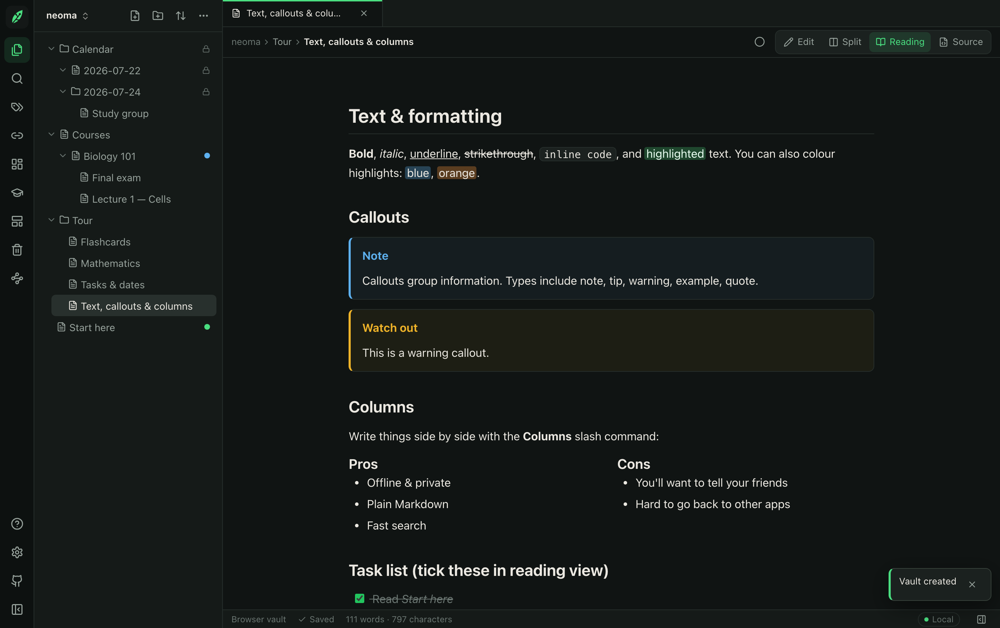
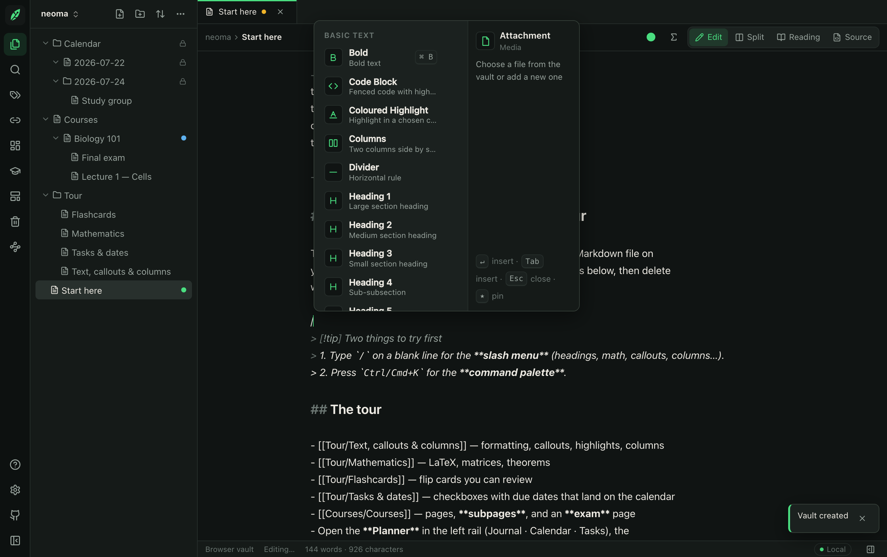
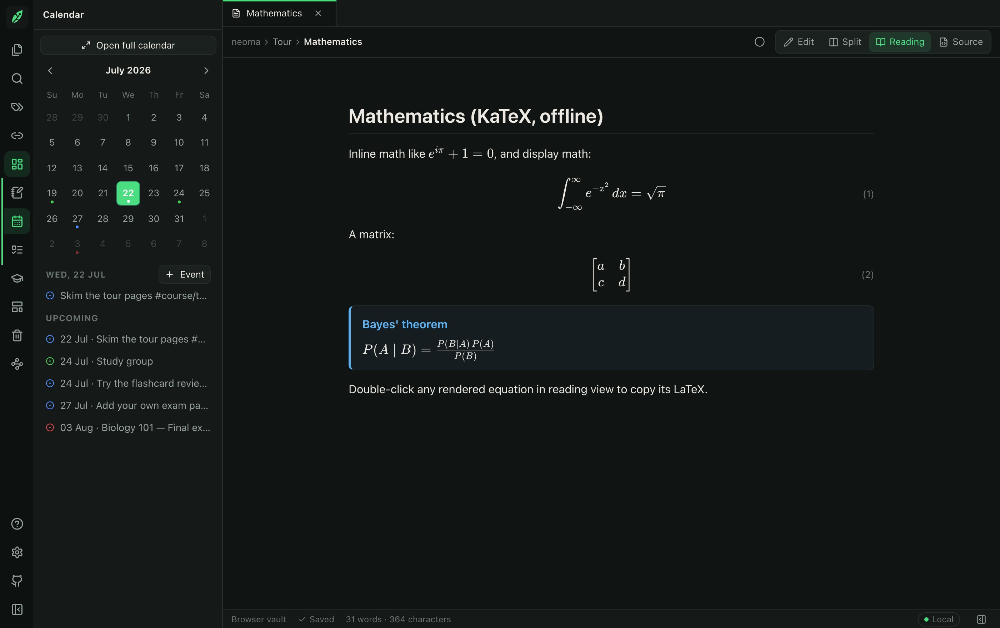
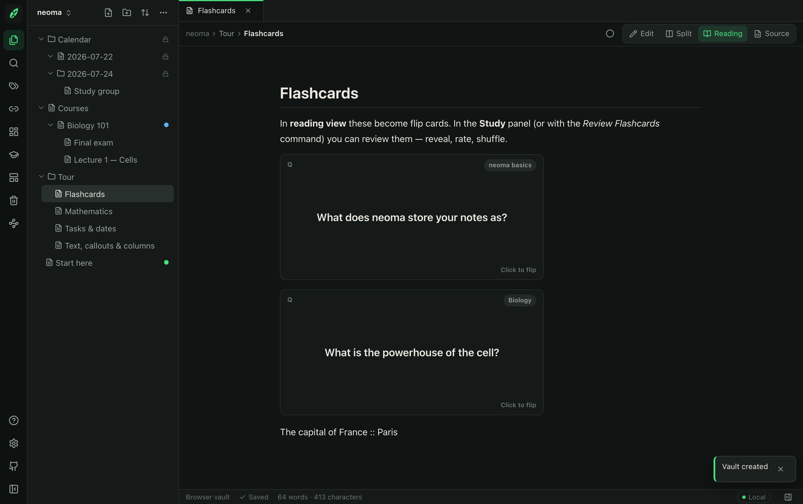
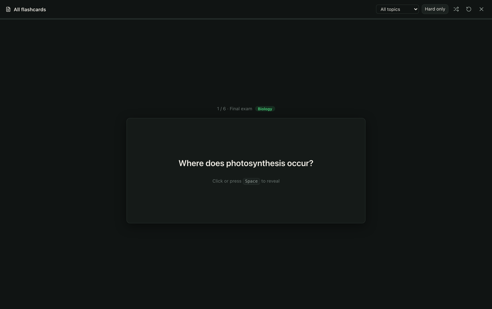
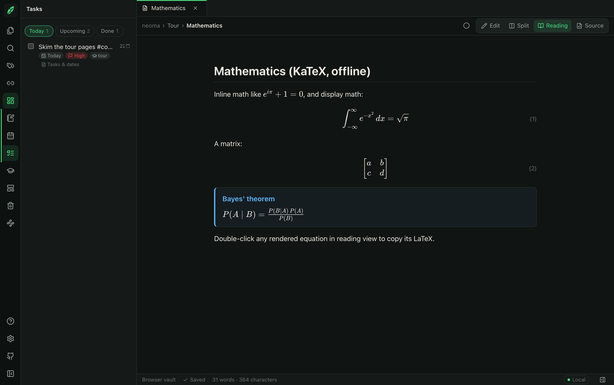
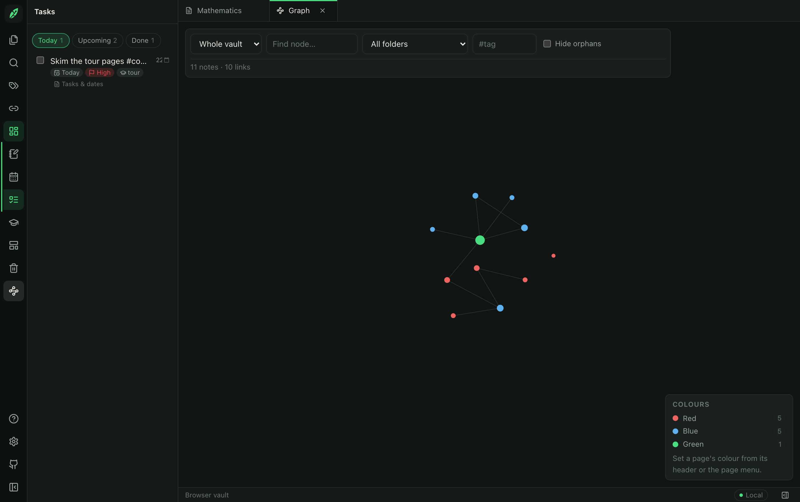

<div align="center">


# Neoma

**Your knowledge, rooted locally.**

Neoma is a lightweight, open-source research journal and linked-note application.
It works in your browser, runs offline and keeps your knowledge in portable Markdown files.

[](LICENSE)
[](https://github.com/infinitumio/neoma/actions/workflows/build.yml)
[](https://github.com/infinitumio/neoma/actions/workflows/test.yml)
[](https://github.com/infinitumio/neoma/releases)
[](#installation)
[](CONTRIBUTING.md)



</div>

---

Neoma is for people who want the essentials of a linked-note tool — Markdown files,
wiki links, backlinks, tags, frontmatter, daily notes, templates, search and a graph —
with **complete data ownership**: no account, no cloud, no telemetry, and notes that stay
readable in any text editor.

## Core principles

1. **Local-first.** Your vault lives on your device — in your browser's storage or in a
   real folder of `.md` files. Nothing is uploaded, ever.
2. **Plain Markdown is the format.** No proprietary database, no lock-in. Every note works
   in VS Code, Obsidian, Logseq, GitHub, or `cat`.
3. **Offline is normal.** After the first load, everything works without internet.
4. **Private by default.** No accounts, analytics, telemetry, ads, tracking or external
   API calls. See [docs/privacy.md](docs/privacy.md).
5. **Light and dependable.** A small, code-split bundle; heavy features (graph, preview
   renderer) load only when used. Data-integrity features protect your work.

## Features

- **Markdown editor** (CodeMirror 6) with edit, split, reading and read-only **source**
  views, plus a floating toolbar to format highlighted text in place
- **Slash commands** (`/`) — a Notion-style inline menu that opens beneath the cursor:
  fuzzy search, category groups, favourites/recents, context-aware ranking and a rich
  preview panel. ~90 commands (headings, lists, callouts, toggles, code, equations,
  theorems, proofs, flashcards, exam questions, lecture summaries) sharing one registry
  with the command palette; all insert portable Markdown
- **Pages and subpages** — nest pages (stored as ordinary folders + files), with
  breadcrumbs and drag-to-nest
- **Wiki links** — `[[Page]]`, `[[Page|Alias]]`, `[[Page#Heading]]` — with autocompletion
- **Backlinks**, linked/unlinked mentions, broken-link and orphan detection
- **Tags** (`#tag` and frontmatter), with a tag browser
- **Coloured highlights** (7 colours) stored as portable, documented syntax
- **Page & file colours** — colour-code pages (portable frontmatter) and files; the graph
  colours nodes to match, with a legend
- **Multiple vaults** with a quick switcher (open tabs remembered per vault)
- **Mathematics** (KaTeX, offline): inline/display, a symbol menu, copy-LaTeX, numbered
  equations, theorem/definition/proof blocks
- **YAML frontmatter**, preserved verbatim — unknown fields are never deleted
- **Full-text search** in a Web Worker: broad / exact-word / exact-phrase modes, scope,
  case-sensitivity, `tag:` / `path:` / `type:` and date filters, with completion stats
- **Daily notes** with calendar picker, configurable folder/format/template
- **Research & study templates** and **starter vaults** (University, Research, Personal)
- **Graph view** (lazy-loaded): whole-vault or local, zoom/pan, filters, depth limit
- **Tabs** with pinning, reopen-closed, and session restore
- **Attachments**: paste or drag images and PDFs, or use the attachment picker (choose from
  the vault or add a file under the page); stored with relative paths
- **In-app PDF viewer** (offline, bundled pdf.js): selectable text layer (copy + find with
  highlights), thumbnails, page nav, zoom, fit-width/fit-page, rotate, fullscreen and print;
  `[[lecture.pdf#page=12]]` links jump to a page; optional split view (PDF + a companion
  note for paraphrasing); PDF embeds/links show a first-page preview card
- **Study workflow**: a Study dashboard (upcoming exams with days-until, recent lecture PDFs
  and notes), an exam-prep template, a **flashcard review** for `Question:: / Answer::` (and
  `front :: back`) cards — reveal, rate confidence, shuffle, hard-only filter, all offline —
  and a distraction-free **study mode**
- **Command palette** (`Ctrl/Cmd+K`) and customisable keyboard shortcuts
- **Import/export**: whole-vault ZIP, single-note Markdown/HTML, print-to-PDF
- **Recently deleted** with restore; conflict detection for external file edits
- **Citation-friendly**: `[@citekey]` recognised and searchable, DOI/BibTeX-key/Zotero-URI
  note properties, Pandoc syntax preserved
- **Neoma Dark & Neoma Light** themes, built entirely on CSS variables
- **Installable PWA** with full offline operation and update notifications

## Screenshots

All captured from the **Feature tour** starter vault — create it yourself from the
welcome screen to click through everything below.

### Slash commands

Type `/` on a blank line for a Notion-style inline menu: fuzzy search, grouped
categories, favourites/recents and a live preview panel. The same commands power the
`Ctrl/Cmd+K` palette, and every one inserts portable Markdown.



### Reading view — maths, callouts and the planner

KaTeX renders inline and display maths offline (double-click an equation to copy its
LaTeX). Callouts, theorem blocks and side-by-side columns all render from plain
Markdown. The left rail's **Planner** group holds a mini-calendar, journal and tasks;
day dots mark journal entries, events and exams.



### Flashcards

`Question:: / Answer::` (and inline `front :: back`) pairs stay as plain text in the
file but render as flip cards in reading view, tagged by topic.



### Study & flashcard review

The Study dashboard tracks upcoming exams and recent lecture PDFs. Review your cards
one at a time — reveal, rate confidence, shuffle, hard-only — entirely offline.



### Tasks with due dates

Tasks live in your notes and roll up into one panel — Today, Upcoming and Completed —
with per-task due dates that land on the calendar.



### Graph view

A lazy-loaded force graph of the whole vault (or a local neighbourhood), with node
colours matching page/file colours, zoom/pan, filters and a depth limit.



## Installation

### Quick start (one command)

If you just want to run Neoma, clone the repo and run the bootstrap script for your OS.
It checks Node, installs dependencies, builds the app, opens your browser and serves it —
no other steps needed.

```bash
git clone https://github.com/infinitumio/neoma.git
cd neoma
```

- **macOS / Linux:** `./start.sh`
- **Windows:** double-click `start.bat` (or run it from a terminal)

Then open **http://localhost:4173** (the script opens it for you). Press `Ctrl+C` to stop.
The only prerequisite is [Node.js 20+](https://nodejs.org/); the script tells you if it's
missing.

### Manual setup

```bash
npm ci
npm run dev          # http://localhost:5173
```

To install it **as an app**: open Neoma in a Chromium-based browser and use the browser's
_Install_ action (or the install button in Settings → About). Once installed it launches
in its own window and works fully offline.

## Local development

```bash
npm ci               # install dependencies
npm run dev          # dev server with hot reload
npm run typecheck    # TypeScript
npm run lint         # ESLint
npm run format       # Prettier
npm test             # unit tests (Vitest)
npm run test:e2e     # end-to-end tests (Playwright; runs against a production build)
npm run build        # production build in dist/
npm run preview      # serve the production build locally
```

Requirements: Node 20+ (see `.nvmrc`).

## Docker (optional self-hosting)

```bash
docker compose up --build
# neoma is now at http://localhost:8080
```

Or without compose:

```bash
docker build -t neoma .
docker run --rm -p 8080:80 neoma
```

The container serves the static production build with nginx. Neoma has **no backend** —
self-hosting is just serving files; all data still stays in each visitor's own browser
or local folder.

## Offline use

Neoma registers a service worker that precaches the application shell. After your first
visit you can open the app, create/edit/search notes, follow links, use templates, change
settings, and export data with no connection at all. The status bar shows **Local**,
**Offline** or **Update available** — offline is a normal, supported state, never an error.

## How storage works

| Vault type        | Where notes live                                                                  | Best for                            |
| ----------------- | --------------------------------------------------------------------------------- | ----------------------------------- |
| **Browser vault** | This browser's IndexedDB                                                          | Zero-setup, any modern browser      |
| **Local folder**  | Real `.md` files in a folder you pick (File System Access API, Chromium browsers) | Git, sync tools, file-level backups |

Both are fully local. Browser vaults should be exported to ZIP occasionally (clearing the
site's browsing data deletes them — Neoma tells you this up front). Local-folder vaults
are ordinary files; Neoma asks for folder permission only after you explicitly choose a
folder, and never uploads anything. Details: [docs/storage.md](docs/storage.md).

## Markdown compatibility

Notes are CommonMark + GFM with widely-adopted extensions (wiki links, `==highlights==`,
callouts, math, `[@citations]`). Frontmatter is standard YAML and unknown fields are
preserved. Exported vaults keep their exact folder hierarchy and relative attachment
paths, so they open cleanly in other tools — and vaults are naturally Git-friendly.
Details: [docs/markdown-compatibility.md](docs/markdown-compatibility.md) and
[docs/storage.md § Git](docs/storage.md#using-git-with-a-vault).

## Privacy

> Neoma does not collect, transmit or sell your notes or usage data. Your vault remains
> on your device unless you deliberately export or synchronise it using another tool.

No accounts, no analytics, no telemetry, no ads, no tracking pixels, no external API
calls, no CDN assets, no hidden network requests, no remote AI. See
[docs/privacy.md](docs/privacy.md) for the full policy and how to verify it.

## Roadmap

Version 1 focuses on a reliable editor, storage, offline operation and portability.
Planned next (see [ROADMAP.md](ROADMAP.md)): community plugins and themes, optional
encrypted sync, deeper Zotero integration, canvas, publish-to-web, local AI integrations.

## Contributing

Contributions are welcome — see [CONTRIBUTING.md](CONTRIBUTING.md) for setup, project
architecture, and the checklists (accessibility, privacy, dependency licensing) that
keep Neoma trustworthy. Contributions must not introduce telemetry, tracking, mandatory
cloud services, proprietary note formats, undocumented external requests, or dependencies
that compromise the open-source licence.

## Licence

[AGPL-3.0-or-later](LICENSE). Neoma is free software: you can run, study, share and
improve it, and network-hosted versions must offer their source to users.

## Creator

Neoma was created by **Iwan** as an open-source project for researchers, students,
developers and anyone who wants complete ownership of their notes.

- Repository: `https://github.com/infinitumio/neoma`
- Contact: Discord `panda2187`

_Neoma is an independent, community-driven project. It is not affiliated with Obsidian,
Notion, or any other organisation._
